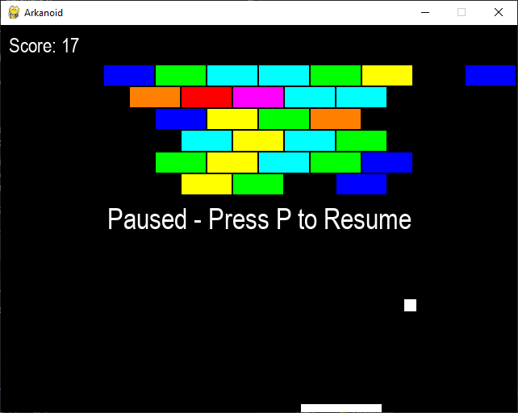

# 🎮 Prosta Gra Arkanoid



Projekt przedstawia klasyczną grę typu **Arkanoid**, w której gracz steruje paletką w celu odbijania piłki i niszczenia bloków. Celem gry jest wyeliminowanie wszystkich elementów na planszy, unikając utraty piłki.

---

## 🕹️ Sterowanie

| Klawisz / Mysz | Opis działania |
|----------------|----------------|
| `Spacja`       | Rozpoczyna rozgrywkę (uruchamia piłkę) |
| `ESC`          | Zamyka aplikację |
| `M`            | Wycisza muzykę w tle |
| `R`            | Restartuje poziom (po wygranej lub przegranej) |
| `P`            | Wstrzymuje i wznawia grę (pauza) |
| `Mysz`         | Steruje paletką (poziome przesuwanie) |

---

## ⚙️ Funkcjonalności

### 🔄 Sterowanie i interakcja
- Obsługa wejścia z klawiatury i myszy
- Intuicyjne sterowanie paletką przy użyciu myszy
- Detekcja kolizji pomiędzy piłką, ścianami, paletką i blokami

### 🧠 Logika gry
- Dynamiczny system punktacji zależny od liczby zniszczonych bloków

### 🧱 Struktura rozgrywki
- Ekran informujący o wygranej lub przegranej
- Możliwość ponownego rozpoczęcia gry bez konieczności zamykania aplikacji
- Obsługa pauzy z możliwością wznowienia rozgrywki

### 🔊 Oprawa dźwiękowa
- Muzyka w tle odtwarzana podczas gry
- Efekty dźwiękowe związane z kolizjami i interakcją
- Możliwość wyciszenia dźwięków jednym przyciskiem

---

## 📂 Wymagania systemowe

Aby uruchomić grę, wymagane jest:

- Python w wersji 3.x
- Biblioteka `pygame` (do instalacji przez `pip`)

---

## 🚀 Uruchomienie gry

W celu uruchomienia gry należy wykonać następujące kroki:

```bash
pip install pygame
python arkanoid.py
